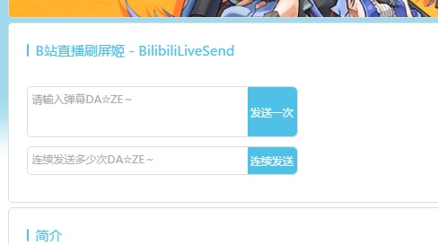

# Bilibili直播间弹幕发送姬 #

Basic on Chrome Extensions
麻麻再也不担心我刷屏不够快啦

## 如何安装 ##

### 墙内用户 ###
[点击此处下载离线安装插件包](https://github.com/moonrailgun/BilibiliLiveSend/releases/download/0.0.1/BilibiliLiveSend.crx)  
在github上下载crx文件。打开`->更多工具->扩展程序`或在地址栏中输入`chrome://extensions/`打开chrome扩展程序标签页。将下载的crx文件直接拖入完成安装。

### 墙外用户 ###

## 如何使用 ##
当进入直播间后会在原简介位置上方生成一个新的标签块：

**手动发送弹幕**
> 在输入弹幕文本框中输入文字。点击**发送一次**即可发送弹幕。同b站正常发送弹幕方法一致。但不会清空输入文本。

**自动连续发送弹幕**
> 在输入弹幕文本框中输入文字，在发送次数文本框中输入自然数。点击**连续发送**就会自动发送弹幕。内置200ms发送间隔防止意外情况。

## 使用范围 ##
域名为`http://live.bilibili.com/`的B站直播间

## 开源协议 ##
- 基于[GPLv2](./LICENSE)协议发布开源代码
- 基于Chrome扩展插件引擎开发